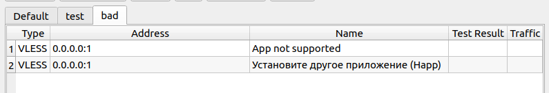
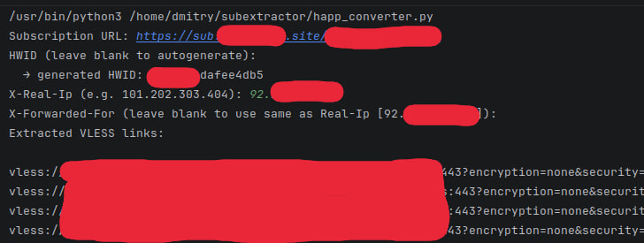

# Happ Converter

Инструмент для извлечения VLESS/Hysteria2/Trojan конфигов из Happ-подписок с встроенным сервером подписок и дешифрацией `happ://crypt*` ссылок.

---

> **Дисклеймер**
>
> Данный проект предоставлен **исключительно в образовательных и исследовательских целях**.
> Автор не несёт ответственности за любое использование этого инструмента, которое нарушает
> условия использования сторонних сервисов, законодательство вашей страны или права третьих лиц.
> Используйте только с данными, к которым у вас есть законный доступ.

---

### Мотивация

Почему просто не пользоваться Happ? У него нет открытого исходного кода (есть только [репозиторий-заглушка](https://github.com/Happ-proxy/happ-desktop)), а значит владелец проекта может делать что угодно — в том числе с вашим устройством.

Кроме того, некоторые провайдеры запрещают импортировать подписки в приложения, отличные от Happ:



---

## Возможности

- Получение VLESS-конфигов из Happ-подписок
- Дешифрация `happ://crypt`, `crypt2`, `crypt3`, `crypt4`, `crypt5` ссылок (Python-порт [happ-decrypt-universal](https://github.com/ivanovdd1/happ-decrypt-universal))
- Встроенный FastAPI-сервер подписок — импортируйте напрямую в Hiddify, Nekoray и другие клиенты
- Статический сайт-подписчик для деплоя на Netlify (`web-sub/`)

---

## Установка

```bash
git clone https://github.com/XuliGan4eg2006/Happ-converter
cd Happ-converter
pip3 install -r requirements.txt
```

---

## Запуск

```bash
python3 happ_converter.py
```

Скрипт запросит:

| Поле | Описание                                                                    |
|---|-----------------------------------------------------------------------------|
| Subscription URL | URL подписки (`https://...`) или зашифрованная ссылка (`happ://crypt5/...`) |
| HWID | ID устройства (по умолчанию — сгенерируется автоматически)                  |
| X-Real-Ip | IP-адрес для заголовка                                                      |
| X-Forwarded-For | IP-адрес для заголовка (по умолчанию = Real-Ip)                             |

По окончании скрипт выведет список VLESS-конфигов и предложит запустить сервер подписок.



---

## Сервер подписок

После извлечения конфигов можно запустить локальный HTTP-сервер:

```
GET http://localhost:8080/    → plain-text подписка (для Hiddify / Nekoray / Ваш клиент)
GET http://localhost:8080/docs → Swagger UI
```

Вставьте `http://<ваш-ip>:8080/` как URL подписки в клиенте.

---

## Дешифрация happ://crypt* ссылок

Если URL подписки начинается с `happ://crypt`, скрипт автоматически расшифрует его перед запросом.

Поддерживаемые схемы: `crypt`, `crypt2`, `crypt3`, `crypt4`, `crypt5`.

Ключи хранятся в `assets/native_keys.json` и `assets/crypt5_final_keys.json`.

---

## Статический сайт для подписки (Netlify)

Папка `web-sub/` — готовый сайт для деплоя на Netlify.

1. Вставьте ваши VLESS-ссылки (по одной на строку) в файл `web-sub/sub/<ваш-секрет>`
2. Задеплойте папку `web-sub/` на [Netlify Drop](https://app.netlify.com/drop)
3. URL подписки: `https://ваш-сайт.netlify.app/sub/<ваш-секрет>`

---

## Структура проекта

```
happ_converter.py     — основной скрипт
parser.py             — парсинг JSON-ответа подписки в VLESS-ссылки
happ_decrypt.py       — дешифратор happ://crypt* (Python-порт)
converter.py          — конвертер VLESS URI → sing-box JSON
server.py             — FastAPI сервер подписок
assets/               — RSA-ключи для дешифрации
web-sub/              — статический сайт для Netlify
requirements.txt      — зависимости Python
```

---

## Credits

- [bubasik](https://gist.github.com/bubasik/af37247b71ca0b253161b48614aba61a) — оригинальный PHP-скрипт
- [happ-decrypt-universal](https://github.com/ivanovdd1/happ-decrypt-universal) — Rust-дешифратор happ://crypt*
